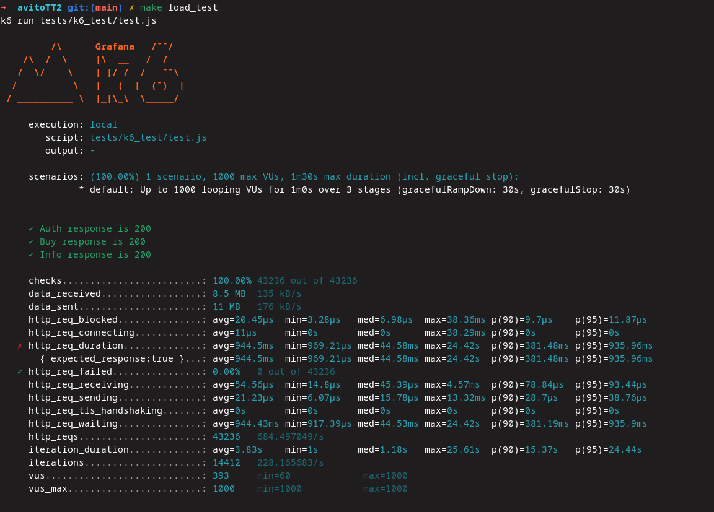
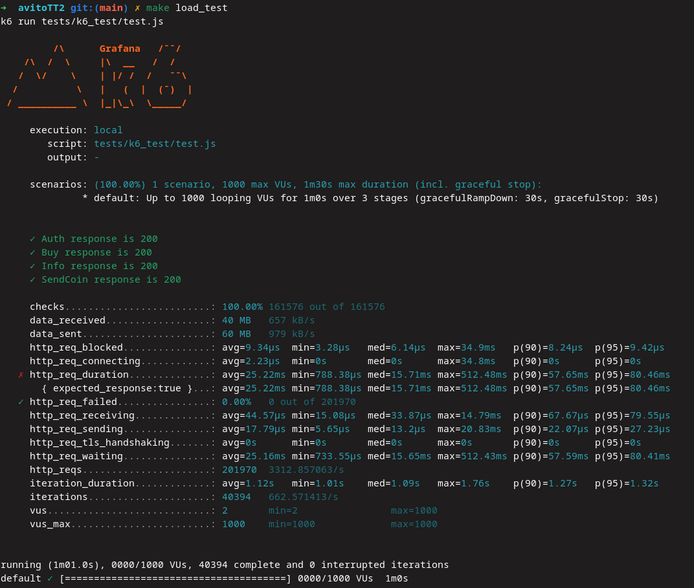

# Avito Test Task

Данный проект представляет собой сервис по продаже мерча. API разработано на **Golang** с использованием **Echo Server**. Сервис упакован в **Docker**, что упрощает его развертывание и масштабирование.

## Запуск проекта

1. Склонируйте репозиторий:
```bash
   git clone https://github.com/Saracomethstein/avitoTT2.git
```

2. Перейдите в директорию проекта:
```bash
cd avitoTT2
```

3. Запустите сервис в контейнере:
```bash
make docker-up
```

### Тестирование

1. Запуск unit тестов:
```bash
make test
```

2. Запуск Postman коллекций: 
```bash
make postman_test
```

3. Запуск k6 тестов:
```bash
make load_test
```

## Результаты


Написал рабочее API и впервые провёл нагрузочное тестирование. Использовал k6 — отличный инструмент.

Не удалось уложиться в лимит 50 мс, скорее всего, проблема была в самом тесте, так как для каждого запроса создавался новый пользователь, а иногда даже два. В любом случае, проект получился интересный, есть чему ещё поучиться. Как и в прошлый раз, благодарю за вызов и интересную задачу!

### UPD (Анекдот вам на вечер ;D)


Я долго думал, в чём же может быть проблема? Нагрузка на контейнер держалась на 600%, а потом за секунду падала до 0. Я думал, что проблема в сборке, в работе с БД и подобных вещах. Я сильно ошибался. Оказалось, что вся проблема была в постоянном выводе логов о том, что запрос зашёл в определённую ручку. И смешно, и плакать хочется.